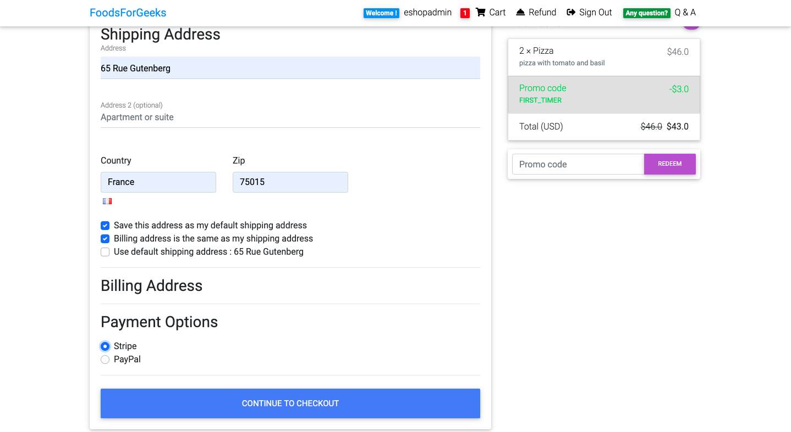

# Food Delivery E-commerce Website Made with Django Python

---

> ### Features included

- [x] Sign up / login function
- [x] Adding items to the shopping cart / Changing the quantity / Deleting items from the shopping cart
- [x] Filling out an order form and entering payment information
- [x] Payment feature with Stripe
- [x] Refund request function
- [x] Items sorting function
- [x] Search items function by keywords
- [x] Question & Answer Board
- [x] Writing posts function
- [x] Post recommendation function
- [x] Answer post and comment function

---

 

### Preview

 

---

> ### How to try it out 👇🏼

- Clone
- Type `source env/bin/activate` in the terminal to enter the virtual environment.
- Run `python manage.py runserver` to start the local server.

---
